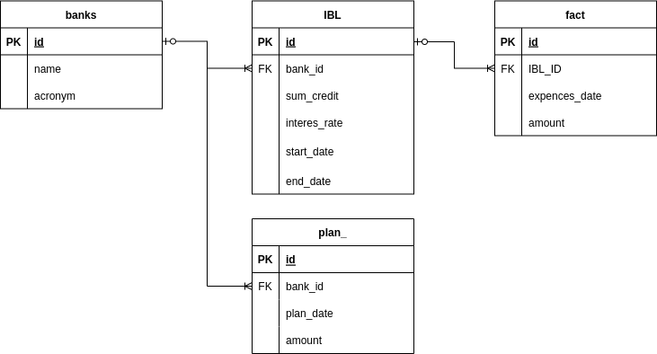

# Тестовое задание
## Навигация
sql/ - содержит запросы для создания, заполнения, для необходимой выборки и очистки БД
img/ - содержит .png ER диаграммы

IBL.db - sqlite3 База данных
main.ipynb - содержит код для вывода графика

## ER-диаграмма

